# Sea Essence Website

The Sea Essence website is a responsive and visually appealing travel website that aims to inspire and allow holidaymakers to seek a getaway in the Indian Ocean. 
It allows visitors browsing the website to easily contact the company's travel experts to plan their chosen dream destination.

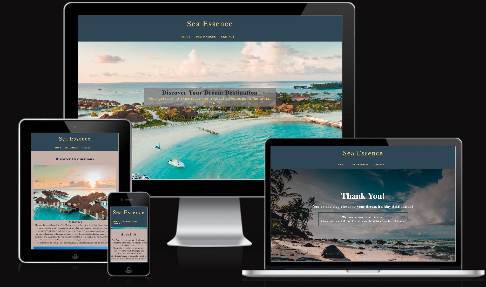

[View Sea Essence on GitHub Pages](https://joanas2.github.io/Sea-Essence/)

- - -
## User Experience (UX)
### Key information
 * Users can find information on different handpicked selections of tropical destinations as well as high-quality images enticing travelers to visit.
* Allows users to easily fill out a query form with their holiday destination requests so that travel experts can best plan and be in touch within short notice.
 * The website provides a table that shows the best times to travel.

- - -

## Client Goals
### First-Time Visitor Goals:
* As a First Time Visitor, I want the website's content to be engaging and to be inspiring as well as informed about tropical holiday destinations in the Indian Ocean.
* As a First Time Visitor, I want to be able to easily navigate the different sections of the page, allowing users to find information effortlessly.

### Returning Visitor Goals:
* As a Returning Visitor, I want to see updated and new content and travel destination inspiration.
* As a Returning Visitor, I want to find a way to easily contact travel experts to plan my chosen destination, so that I can also ask any questions and send requests.

### Frequent Visitor Goals:
* As a Frequent User, I want to stay informed about the latest travel inspirations and receive reliable and up-to-date information to build trust with the travel website.

- - -

## Design

### Color Scheme
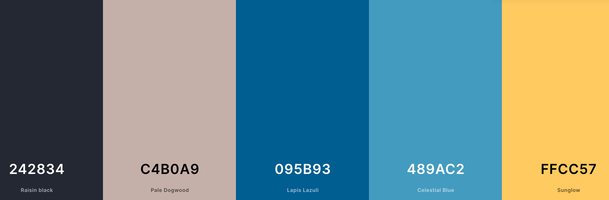
The color palette used is thought to stimulate and encourage relaxation.

• Different shades of blue are used to create a sense of harmony and tranquility, providing emphasis on nav links using the hover effect, illustrating the colors of the ocean.

* Sunglow yellow was used as a relatively brighter color to captivate attention.

The color palette was created using the [Coolors](https://coolors.co/) website.

### Typography

Google Fonts was used for the fonts chosen
* Noto Serif Google font is used for the headings, used in bold to attract viewers.
* Lato Google Fonts was used to increase the readability of the website's content.

### Wireframes

Wireframes were created using Balsamiq for mobile, tablet and desktop.
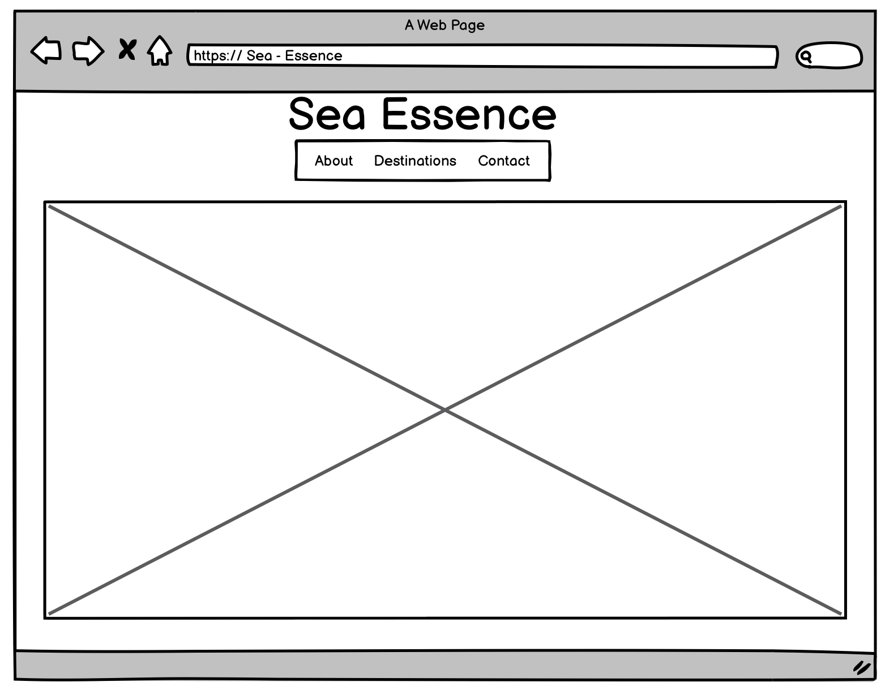

- - -
## Features
The website consists of three sections on a page, which are accessible from the navigation menu which includes an about, destinations and a contact section. When the user submits a form in the contact section this redirects them to a thank you page.

### Navbar
* A responsive navigation bar is positioned fixed at the top of the page which allows the users to easily navigate.
* Contains the logo as a h1, as the home section with a hero image and easy-to read-text.
* Contains navigation links aligned to the center:
* ABOUT - leads to the content explaining what the Sea Essence website is in addition to content about the Indian Ocean and the best time to travel according to the weather.
* DESTINATIONS - this leads to the section where users can discover and find inspiration on different destinations in the Indian Ocean.
* CONTACT - leads to the inquiry form which users can fill out if they have any questions or requests to ensure travel experts can plan their desired holiday.

 - The links all have an animated hover effect making it easy and clear for the website user to understand and a cursor pointer is shown when the mouse is hovered for a clickable section.

 

### Hero Section

* The Hero section contains a bright background image that covers the page when the home page is loaded on the browser.
* Contains a  hero text which is centered and positioned to absolute. Meant to entice users to continue browsing. 

- - -

### About Section

*  This section gives users an overall insight into what the Sea Essence website is aimed at which is to inspire and plan desired holiday destinations to the Indian Ocean as per request.

* Also consists of a table providing the best temperatures during 4 different months of the year that is most recommended to visit.

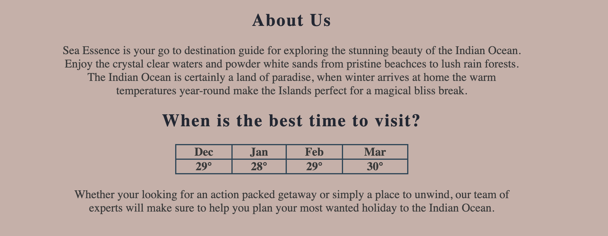

- - - 

### Destinations Section

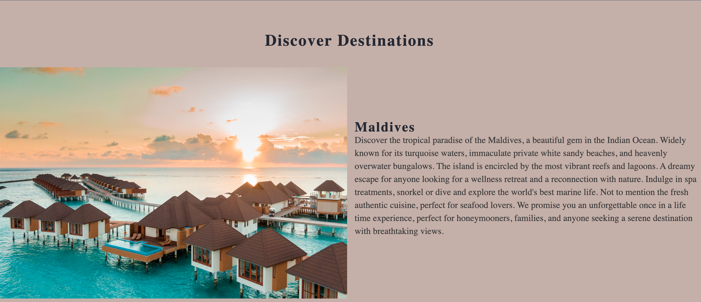
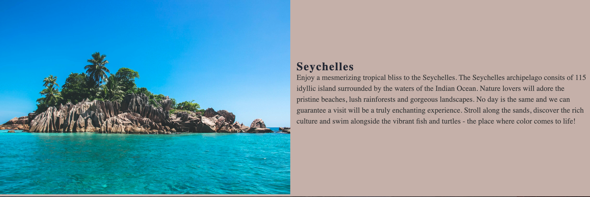

### Contact Section

* Allows users to make inquiries or any questions they may have regarding holiday destinations.
* A sunset background image is used fixed which blends in very well with the website.
* The form contains fields for the user's name, address and text area field and button to submit the form.
* A telephone number field is also included which is not a required input so is the choice of the user whether they would like to be contacted by telephone. They will be shown if a certain area is missing information. 
 
 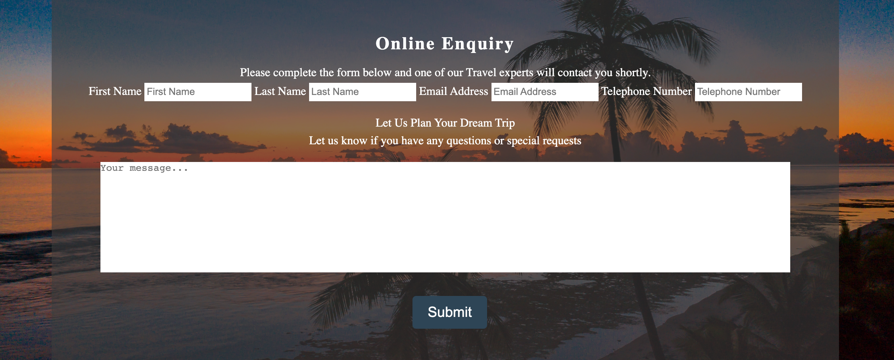

- - -
### Thank You Page

* A message is shown as a response to the user thanking them for submitting the form and making them aware that someone will be in touch very soon.
* The Page has a background image used with a linear gradient to ensure the user can visibly see the text content.

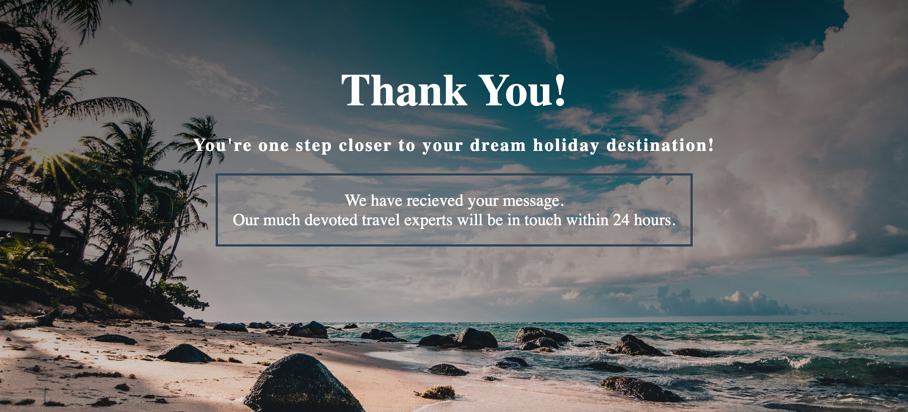

- - -
### Footer
* The footer contains social media links that open in a new tab. 

## Technologies used

#### Languages used 
 - HTML was used as the foundation of this website.
 - CSS was used to create and add styling and layout to this website.

 ### Frameworks and programs used
 - Google Dev Tools was used throughout to test features, styling, responsiveness of the website and troubleshooting.
 - VSCode was used to write and edit code.
 - CSS Flexbox was used to align flex items along the main axis.
 - Balsamiq was used to make wireframes.
 - Git was used for version control of the website created.
 - Github was used to store and save files and host the source code.
 - Google fonts to import fonts.
 - Font Awesome was used as the icon library for the social media icon links.
 - [Am I Responsive?](http://ami.responsivedesign.is/)
  was used to show the image of the website on different devices.
## Credits

#### Media 

- All the images for the website were taken from [Pexels](https://www.pexels.com/).

- [Hero image](https://www.pexels.com/photo/aerial-view-of-a-beautiful-island-resort-3601425/)

+ Destinations:
- [1st image](https://www.pexels.com/photo/brown-and-white-wooden-houses-on-body-of-water-during-sunset-3601426/)
- [2nd image](https://www.pexels.com/photo/blue-sky-above-st-pierre-island-in-seychelles-5048704/)

- [Form section image](https://www.pexels.com/photo/sea-during-golden-hour-3155647/)

- [Thank you page background](https://www.pexels.com/photo/seaside-994605/)

#### Tools

- [Tiny PNG](https://tinypng.com) was used to compress images.
- - -

## Deployment and Local deployment

## Deployment

The site was deployed using GitHub Pages. This was done as followed:

- Log in to Git Hub
- Find the repository for the project and navigate to the settings tab
- Click on the pages link, on the left side of the navigation bar
- Once in the source section, select the main branch from the drop-down selection and select root from the drop-down folder menu.
-Lastly, click save and the live GitHub pages are now deployed.

## Local Development
## How to clone

A local copy of this project can be found by cloning it.
- Log in to Git Hub
- Find the repository for the Sea Essence project and click on the green code button. Options are given whether you would like to clone with HTTPS, SSH or GitHub CLI. Copy this link.
- In your IDE Terminal type 'git clone' and paste the link copied. Press enter.

To clone my repository you can type the following command:

git clone https://github.com/JoanaS2/Sea-Essence.git

### How to Fork
To fork this repository:
- Log in to Git Hub
- Find the repository for the Sea Essence project and click fork on the top right corner just below the settings tab.

 - - -
 ## Validator Testing
 ### W3C Validator 

 I have used the W3C validator to validate the HTML on both the Index page HTML and Thank You page HTML.

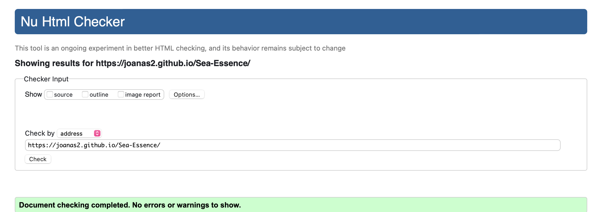
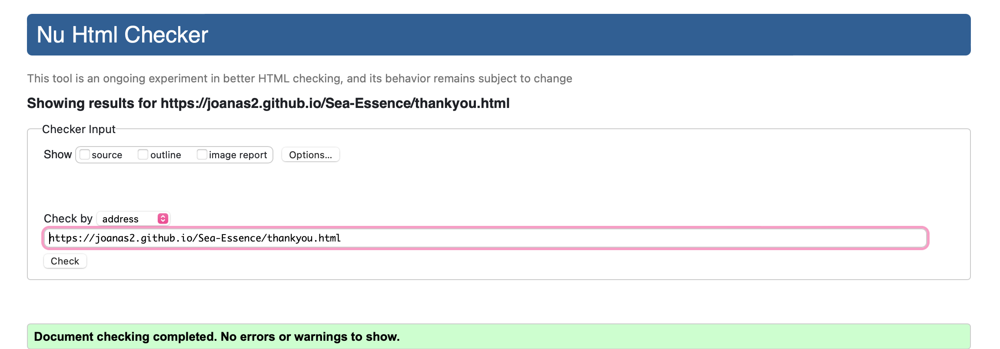

W3C validator was also used to validate the CSS in the style.css file

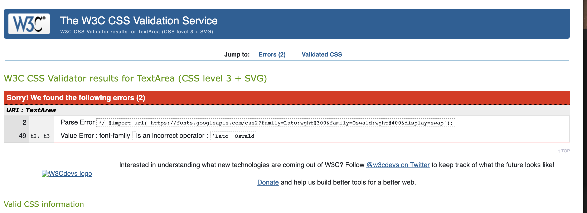
I acknowledged that the import URL for the Google font isn't working towards the end of my project submission. For future reference,  I know what I will need to do and identify that I should leave extra time during the last checks for validation errors due to working with styling and responsiveness.

---
### Lighthouse
I used Lighthouse in the Chrome Developer Tools which tests the performance, accessibility, best practices and SEO of the website.

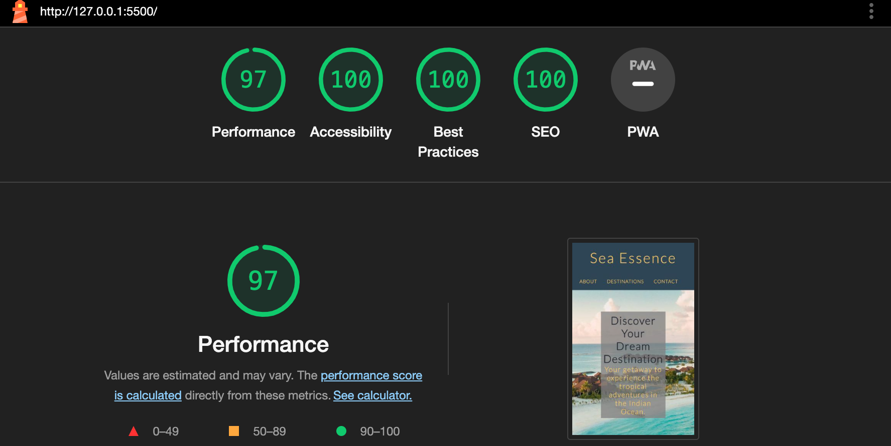

## Solved Bugs 
- The footer on both pages was displayed in the middle of the screen causing the background image to shrink. It was found that the reason for this was because I was using too much padding.
- Textarea was overflowing out of the div section. The display set to none solved the issue.
- The navbar was losing its alignment when on smaller devices. My mentor suggested changing the margin and I also removed the height-align.

## Future Improvements
* Optimize page load times and implement efficient and more navigation to enhance user satisfaction.
* Expand on the destinations section and create a page by using javascript so users can find navigating destinations in more depth such as pricing and tour packages we offer.
* add custom 404 page
* I will improve the quality and quantity of commit messages in the future

### Acknowledgments
- [Code Institute](https://codeinstitute.net/) for all tutor assistance and Slack members for support and help when needed.
- [Iuliia Konovalova](https://github.com/IuliiaKonovalova), my Code Institue mentor.

  

